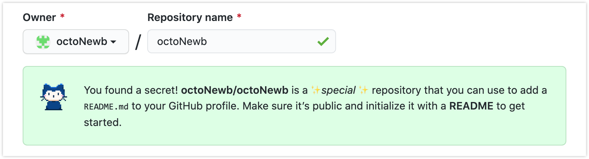
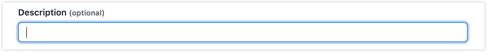
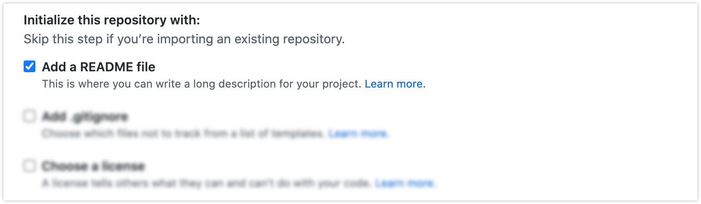
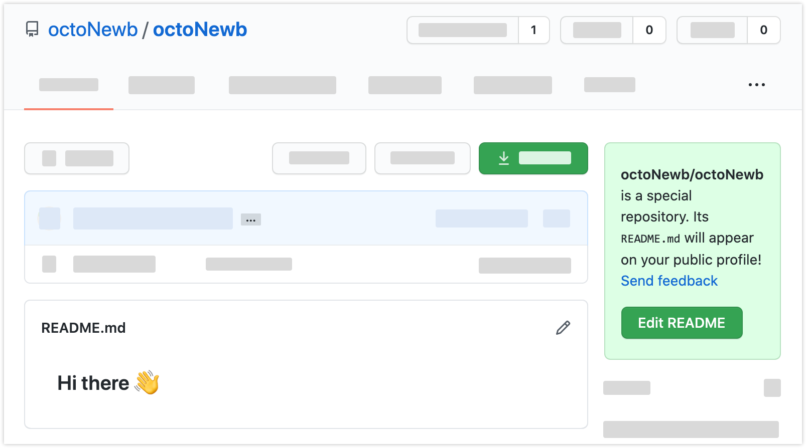
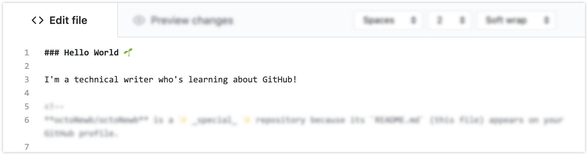
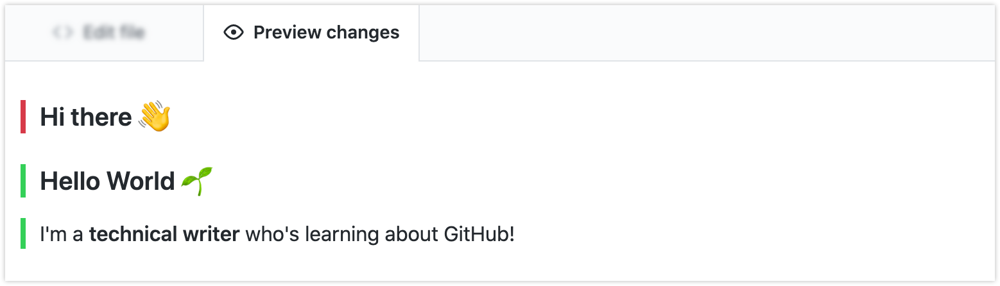
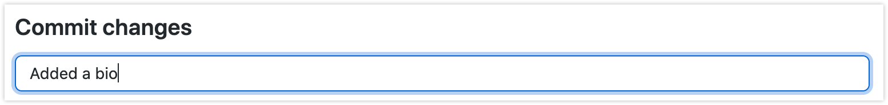
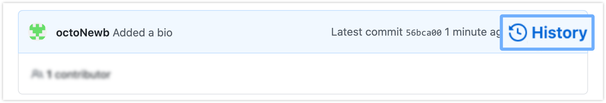

# Creating your profile README
Get started with GitHub by customizing your user profile with a text file. ✏️

 

#### In this tutorial:

[Introduction](#introduction)  
[Create your repository](#create-your-repository)  
[View your README](#view-your-readme)  
[Edit your README](#edit-your-readme)  
[Commit changes](#commit-changes)  
[View version history](#view-version-history)  
[Success](#success)  
[Next steps](#next-steps)

 

## Introduction

This tutorial will show you how to create a file on GitHub that *you* own... without code.

GitHub is commonly known as a place where programmers store and work with code. But you can also use it to work with text. In fact, there's an (open) secret on GitHub called the "profile README." It's a simple but highly customizable text file that appears on your user profile. 
  <!-- Add in when explainer doc is complete > **Note:** To learn more about why non-coders belong on GitHub, see ["What can non-coders do with GitHub?"]() -->

#### What you need to complete this tutorial:

  * An account. [Create a GitHub account](https://github.com/join) if you haven't already.
  * Open GitHub.com in any desktop browser. 
  * You *don't* need any knowledge of GitHub or programming.

 

## Create your repository

Before creating a file, you need a place to store it. These storage places are called "repositories" on GitHub.

 

1. Click the **plus symbol** in the navigation bar at the top of any page on GitHub. Select **New repository.**

1. Type your username into the **Repository name** field. This lets GitHub know you're creating a *special* repository... One that will appear on your profile! 
 
   *✅ &nbsp; Check: If you name the repository correctly, a special notice will pop up. Congratulations! If not, check for spelling mistakes or extra spaces. The repository name isn't case-sensitive.*

1. Leave the **Description** field blank. Anything you type here won't appear on your profile.

1. Select **Public** to ensure the repository will appear on your profile.

1. Select **Add a README file.** This automatically places one text file into your repository.

1. Click **Create repository.**

 

   
   
   
   

 

You're automatically directed to a new page. This is the "home" of the repository. Your single README file is stored here like a sheet of paper in a folder. 

*👉&nbsp; Note: If you're feeling confused by all the buttons and information on this page, don't worry. You won't need them for this tutorial. Some repositories (like those for programming projects) contain many files. This page helps you manage them.*

 

 

Next, let's make sure that the README appears on your profile.

 

## View your README

1. Navigate to your profile by clicking the avatar icon in the navigation bar. Select **Your profile.**

1. Notice the box at the top of your profile that says `Hi there 👋.` This is your profile README. Success! 

 

Next, you'll customize it with your own message.

 

## Edit your README

1. Click the **pencil icon** in the top-right corner of your profile README. A text editor opens.  
    
   This text editor uses a language called Markdown that helps you format text. For example, notice the placeholder text `### Hi there 👋`. The `###` symbols tell GitHub to format the words as a big, bold header.

1. Delete `Hi there 👋.` and replace it with your own greeting.

1. Press enter twice to create a new line of text. Type a fact about yourself that you want to share with the GitHub community! Try using some of the ideas that GitHub lists in the comments.

1. Put two asterisks around some of your text to make it **bold.** 

   *✅ &nbsp; Check: Don't include extra spaces inside the asterisks. For example, type `make it **bold.**`, not `make it ** bold. **`*

    

1. Click the **Preview Changes** tab to see your formatting in action. Sections highlighted with a red bar have been deleted. They'll disappear when you save your changes.
  
   *👉&nbsp; Note: Do you notice that the list of ideas isn't visible in the preview? That's because the surrounding brackets `<!-- -->` turn them into invisible comments.*

    

1. Click the **Edit file** tab to return to the text editor.  
    
1. Play around with the text editor as much as you'd like. See the [Mastering Markdown](https://guides.github.com/features/mastering-markdown/) guide to discover more formatting options.

 

Next, you'll save your changes in a process called "committing."

 

## Commit changes

When you commit changes, GitHub doesn't delete the old version of the file. Instead, it saves all versions in a file history. GitHub is essentially a version control system, which makes it great for collaboration. But version control is also useful for you as an individual. You can keep track of your changes and retrieve earlier versions if needed.

 

1. In the field below the text editor, type a short phrase that summarizes your changes. 

1. Select **Commit directly to the main branch.** This saves changes to the main file.

1. Click **Commit changes.**

 

   
   

 

Good job! Your changes are now visible in your repository.

 

## View version history 

A notification about your most recent commit is highlighted in blue. 

 

1. Click **History** to view all past versions of the file. Each time you commit changes, another version adds to this list.

    

1. Navigate back to your profile by clicking the avatar icon in the navigation bar. Select **Your profile.** The most up-to-date README appears at the top of your profile. 

 

## Success 

You created a README file that appears on your profile. You can customize it to share anything with the GitHub community.

You also learned about some important concepts that you'll see often on GitHub:

  * **Repositories** are like folders for storing files.
  * A **README** is a text file within a repository.
  * **Markdown** is a language used to format text.
  * **Committing** is how you save changes.
  * GitHub is a **version control system** that lets you view all commits made to a file in the past.

 

## Next steps

* [Explore creative profile READMEs](https://awesomegithubprofile.tech/) from around the community.
* Read the [Be social](https://docs.github.com/en/github/getting-started-with-github/be-social#watching-a-repository) guide to learn about how you can interact on GitHub.
