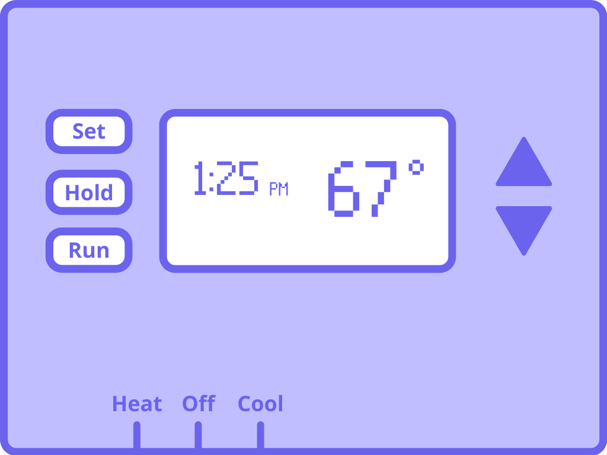

# It's too hot/cold. Is my thermostat working?

It can be confusing to tell if a temperature problem is caused by your thermostat, your heating and cooling unit, or your home. But it might not be a malfunction. First, you can check that your thermostat's controls are set correctly.

 

 

*Location of your thermostat's controls.*

 

## Check the display

- If it's blank, [change the batteries](URL).
- If there's an error message, check our list of [Common error messages](URL).

If it still doesn't turn on, there may be a [wiring issue](URL).

 

## Check if the Heat/Cool switch is on

Make sure the switch on the bottom of the thermostat is set to **Heat** or **Cool**, not **Off**.

Note that a *Heat On* or *Cool On* indicator appears on-screen while the temperature is adjusting.

 

## Check the temperature schedule

❗ | Heating and Cooling have separate schedules. Make sure the switch on the bottom of the thermostat is set to **Heat** or **Cool** before following these steps.
--- | :---

To view and set the temperature schedule:

1. Press **Set** twice. *Set Schedule* appears at the bottom of the screen and the clock starts blinking. This is the first scheduled time. You can change it by pressing the **up or down arrows**.
1. The scheduled temperature for that time of day is shown to the right. To change it, press **Set** again so that it starts blinking. Then press the **up or down arrows**.
1. Keep pressing **Set** to cycle through the whole schedule. Change the times and temperatures as needed.

 

## Check if the clock is set to your current time

Even with your schedule set correctly, the thermostat's overall clock could be wrong. This is common after replacing batteries. To set the clock:

1. Press **Set** once. The clock starts blinking.
1. Press the **up or down arrows** to change the time.
1. Press **Set** again to confirm.

 

## Still having problems?

🛠️&nbsp; Follow the next steps in our [troubleshooting guide](URL) to investigate other possible issues. We'll walk you through what to do and when to call an expert.

👋&nbsp; Or [contact us](URL). We'd be happy to help!
